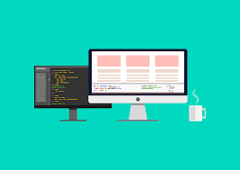

### Hi there 👋

I'm Ibukun from Nigeria and i'm into web development. 
I'm currently working on building my skills.
I really keen on learning and i'm currently learning JavaScript.
I'm very open to work with anyone and i'm also in need of an intership.
I hope to become one of the best in the next few years.

### Hi there 👋, Ibukun
#### Frontend web developer

I'm currently working on building my skills.
I really keen on learning and i'm currently learning JavaScript.
I'm very open to work with anyone and i'm also in need of an intership.

Skills: / HTML / CSS / JavaScript

    
